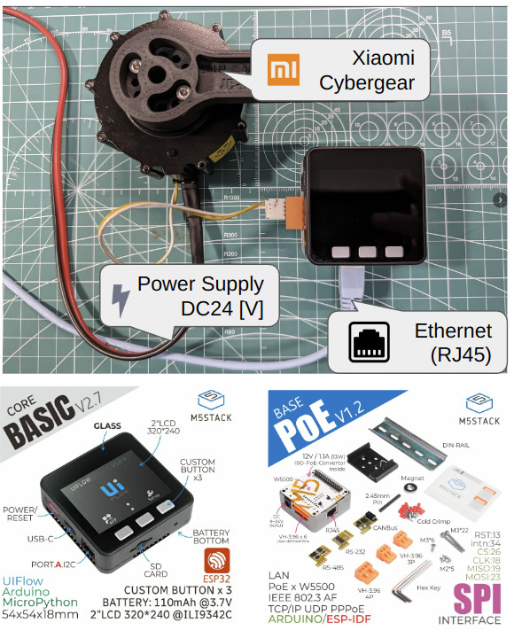

# Cybergear ROS2 Controller

## Package Summary

This package is for controlling Cybergear on M5Stack. By using Micro-ROS, you can control multiple Cybergears via Ethernet (RJ45)

## Hardware Components



* [Xiaomi Cybergear](https://www.mi.com/cyber-gear)
* [M5Stack Basic V2.7](https://shop.m5stack.com/collections/m5-controllers/products/esp32-basic-core-lot-development-kit-v2-7)
* [LAN Module W5500 with PoE V12](https://shop.m5stack.com/products/lan-module-w5500-with-poe-v12)
* [XT30(2+2)-F](https://www.china-amass.com/product/contain/1Yf5h7G4u1927079)
* [Grove Cable](https://www.seeedstudio.com/Grove-Universal-4-Pin-Buckled-20cm-Cable-5-PCs-pack.html)

## How to Build

Clone this repository and open this repository with vscode whitch is installed platform plugin.

```bash
git clone git@github.com:project-sternbergia/cybergear_micro_ros_m5.git
code cybergear_micro_ros_m5
```

We need to modify and build micro_ros_arduino repository because resolve constraint of number of ros services.

```bash
cd cybergear_micro_ros_m5
cd .pio/libdeps/m5stack-core-esp32/micro_ros_arduino
patch -p1 ../../../../patch/colcon.meta.patch
docker pull microros/micro_ros_static_library_builder:humble
docker run -it --rm -v $(pwd):/project --env MICROROS_LIBRARY_FOLDER=extras microros/micro_ros_static_library_builder:humble -p esp32
```

Build and upload binary to m5stack via vscode.

## Setup Firmware

TBD

## How to Use

Launch micro-ros-agent using docker.

```bash
docker run -it --rm --privileged --net=host microros/micro-ros-agent:humble udp4 --port 2000
```

Check ros2 connection using follow command.

```bash
ros2 topic list
> /cgc_node/joint_command
> /cgc_node/joint_state
> /parameter_events
> /rosout

ros2 service list
> /cgc_node/cgc_node/describe_parameters
> /cgc_node/cgc_node/get_parameter_types
> /cgc_node/cgc_node/get_parameters
> /cgc_node/cgc_node/list_parameters
> /cgc_node/cgc_node/set_parameters
> /cgc_node/control_power

ros2 param list
> /cgc_node/cgc_node:
>   xxx.cur_filter_gain
>   xxx.cur_ki
>   xxx.cur_kp
>   xxx.limit_current
>   xxx.limit_speed
>   xxx.limit_torque
>   xxx.loc_kp
>   xxx.run_mode
>   xxx.spd_ki
>   xxx.spd_kp
```
xxx means motor name.

Start cybergear controller. When start cyberger controller, reflect all ros2 parameter to cybergear.

```bash
ros2 service call /cgc_node/control_power std_srvs/srv/SetBool data:\ true
```

Execute sample code for ros2.

```bash
source /opt/ros/$ROS_DISTRO/setup.bash
cd cybergear_micro_ros_m5/scripts
python3 xxxxx.py
```

## ROS2 Parameters

Please be extremely cautious when changing control gains, as there is a possibility that Cybergear may go out of control. We will not take responsibility for any injuries incurred.

| name            | desc                                                                                                      | default     | min | max   |
| --------------- | --------------------------------------------------------------------------------------------------------- | ----------- | --- | ----- |
| run_mode        | The run mode of cybergear. cybergear support 4-control mode, motion(0), position(1), speed(2), current(3) | position(1) | 0   | 3     |
| limit_speed     | Cybergear limit speed [rad/sec]                                                                           | 2.0         | 0.0 | 30.0  |
| limit_current   | Cybergear limit current [A]                                                                               | 27.0        | 0.0 | 27.0  |
| limit_torque    | Cybergear limit torque [Nm]                                                                               | 12.0        | 0.0 | 12.0  |
| loc_kp          | Cybergear position control p-gain                                                                         | 30.0        | 0.0 | 100.0 |
| spd_kp          | Cybergear speed control p-gain                                                                            | 2.0         | 0.0 | 50.0  |
| spd_ki          | Cybergear speed control i-gain                                                                            | 0.002       | 0.0 | 0.05  |
| cur_kp          | Cybergear current control p-gain                                                                          | 0.125       | 0.0 | 1.0   |
| cur_ki          | Cybergear current control i-gain                                                                          | 0.0158      | 0.0 | 0.05  |
| cur_filter_gain | TBD                                                                                                       | 0.1         | 0.0 | 1.0   |


## ROS2 Interfaces


## References

* [Xiaomi Cybergear 微电机使用说明书](https://web.vip.miui.com/page/info/mio/mio/detail?postId=40233100)
* [project-sternbergia/cybergear_m5](https://github.com/project-sternbergia/cybergear_m5)

## License

* MIT
